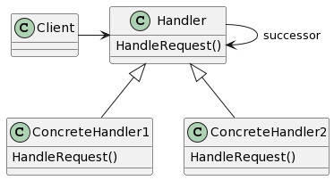

# Chain of Responsibility

## 意图

使多个对象都有机会处理请求，从而避免请求的发送者和接收者之间的耦合关系。将这些对象连成一条链，并沿着这条链传递该请求，直到有一个对象处理它为止。

## 动机

给多个对象处理一个请求的机会，从而解耦发送者和接收者。该请求沿对象链传递直至其中一个对象处理它。

从第一个对象开始，链中收到请求的对象要么亲自处理它，要么转发给链中的下一个候选者。提交请求的对象并不明确地知道哪一个对象将会处理它——我们说该请求有一个隐式的接收者。

要沿链转发请求，并保证接收者为隐式的，每个在链上的对象都有一致的处理请求和访问链上后继者的接口。

## 适用性

- 有多个对象可以处理一个请求，哪个对象处理该请求运行时自动确定。
- 你想在不明确指定接收者的情况下，向多个对象中的一个提交一个请求。
- 可处理一个请求的对象集合应被动态指定。

## 结构

## 参与者

- Handler（如HelpHandler）

—— 定义一个处理请求的接口。
—— （可选）实现后继链。

- ConcreteHandler（如PrintButton和PrintDialog）

—— 处理它所负责的请求。
—— 可访问它的后继者。
—— 如果可处理该请求，就处理之；否则将该请求转发给它的后继者。

- Client

—— 向链上的具体处理者（ConcreteHandler）对象提交请求。

## 协作

- 当客户提交一个请求时，请求沿链传递直至有一个ConcreteHandler对象负责处理它。

## 效果

1. 降低耦合度。
2. 增强了给对象指派职责的灵活性。
3. 不保证被接受。

## 实现

1. 实现后继者链

> - 定义新的链接（通常在Handler中定义，但也可由ConcreteHandler来定义）。
> - 使用已有的链接。

2. 连接后继者
3. 表示请求

## 相关模式

职责链常与Composite一起使用。这种情况下，一个构件的父构件可作为它的后继。
