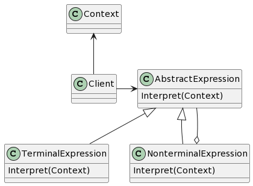

# Interpreter

## 意图

给定一个语言，定义它的文法中的一种表示，并定义一个解释器，这个解释器使用该表示来解释语言中的句子。

## 动机

如果一种特定类型的问题发生的频率足够高，那么可能就值得将该问题的各个实例表述为一个简单语言中的句子。这样就可以构建一个解释器，该解释器通过解释这些句子来解决该问题。

解释器模式描述了如何为简单的语言定义一个文法，如何在该语言中表示一个句子，以及如何解释这些句子。

## 适用性

- 文法简单。
- 效率不是关键问题。

## 结构

## 参与者

- AbstractExpression（抽象表达式，如RegularExpression）

—— 声明一个抽象的解释操作，这个接口为抽象语法树中所有的结点所共享。

- TerminalExpression（终结符表达式，如LiteralExpression）

—— 实现与文法中的终结符相关联的解释操作。
—— 一个句子中的每个终结符需要该类的一个实例。

- NonterminalExpression（非终结符表达式，如AlternationExpression、RepetitionExpression、SequenceExpressions）

—— 对文法中的每一个规则R::=R1R2...Rn都需要一个NonterminalExpression类。
—— 为从R1到Rn的每个符号都维护一个AbstractExpression类型的实例变量。
—— 为文法中的非终结符实现解释（Interpret）操作。解释（Interpret）一般要递归地调用表示R1到Rn的那些对象的解释操作。

- Context（上下文）

—— 包含解释器之外的一些全局信息。

- Client（客户）

—— 构建（或被给定）表示该文法定义的语言中一个特定的句子的抽象语法树。该抽象语法树由NonterminalExpression和TerminalExpression的实例装配而成。
—— 调用解释操作。

## 协作

- Client构建（或被给定）一个句子，它是NonterminalExpression和TerminalExpression的实例的一个抽象语法树。然后初始化上下文并调用解释操作。
- 每一非终结符表达式结点定义相应子表达式的解释操作。而各终结符表达式的解释操作构成了递归的基础。
- 每一结点的解释操作用上下文来存储和访问解释器的状态。

## 效果

1. 易于改变和扩展文法
2. 易于实现文法
3. 复杂的文法难以维护
4. 增加了新的解释表达式的方式

## 实现

1. 创建抽象语法树
2. 定义解释操作
3. 与Flyweight模式共享终结符

## 相关模式

Composite：抽象语法树是一个组合模式的实例。

Flyweight：说明了如何在抽象语法树中共享终结符。

Iterator：解释器可用一个迭代器遍历该结构。

Visitor：可用来在一个类中维护抽象语法树中各结点的行为。
