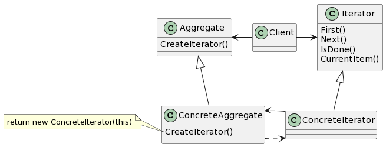

# Iterator

## 意图

提供一种方法顺序访问一个聚合对象中的各个元素，而又不需要暴露该对象的内部表示。

## 动机

一个聚合对象，如列表（list），应该提供一种方法来让别人可以访问它的元素，而又不需要暴露它的内部结构。此外，针对不同的需求，可能要以不同的方式遍历这个列表。但是即使可以预见到所需的那些遍历操作，你可能也不希望列表的接口中充斥着各种不同遍历的操作。有时还可能需要在同一个列表上同时进行多个遍历。

迭代器模式可帮你解决所有这些问题。这一模式的关键思想是将对列表的访问和遍历从对象中分离出来并放入一个迭代器（iterator）对象中。迭代器类定义了一个访问该列表元素的接口。迭代器对象负责跟踪当前的元素，即它知道哪些元素已经遍历过了。

## 适用性

- 访问一个聚合对象的内容而无需暴露它的内部表示。
- 支持对聚合对象的多种遍历。
- 为遍历不同的聚合结构提供一个统一的接口（即支持多态迭代）。

## 结构

## 参与者

- Iterator（迭代器）

—— 迭代器定义访问和遍历元素的接口。

- ConcreteIterator（具体迭代器）

—— 具体迭代器实现迭代器接口。
—— 对该聚合遍历时跟踪当前位置。

- Aggregate（聚合）

—— 聚合定义创建相应迭代器对象的接口。

- ConcreteAggregate（具体聚合）

—— 具体聚合实现创建相应迭代器的接口，该操作返回ConcreteIterator的一个适当的实例。

## 协作

- ConcreteIterator跟踪聚合中的当前对象，并能够计算出待遍历的后继对象。

## 效果

1. 支持以不同的方式遍历一个聚合。
2. 简化了聚合的接口。
3. 在同一个聚合上可以有多个遍历。

## 实现

1. 谁控制谁迭代
2. 谁定义遍历算法
3. 迭代器健壮程度如何
4. 附加的迭代器操作
5. 在C++中使用多态的迭代器
6. 迭代器可有特权访问
7. 用于组合对象的迭代器
8. 空迭代器

## 相关模式

Composite：迭代器常被应用到像组合这样的递归结构上。
Factory Method：多态迭代器靠Factory Method来实例化适当的迭代器子类。
Memento：常与迭代器一起使用。迭代器可使用memento来捕获一个迭代的状态。迭代器在其内部存储memento。
