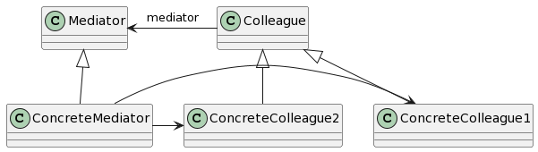

# Mediator

## 意图

用一个中介对象来封装一系列的对象交互。中介者使各对象不需要显式地相互引用，从而使其耦合松散，而且可以独立地改变它们之间的交互。

## 动机

面向对象设计鼓励将行为分布到各个对象中。这种分布可能会导致对象间有许多连接。在最坏的情况下，每一个对象都知道其他所有对象。

虽然将一个系统分隔成许多对象通常可以增强可复用性，但是对象间相互连接的激增又会降低其可复用性。大量的相互连接使得一个对象似乎不太可能在没有其他对象的支持下工作——系统表现为一个不可分割的整体。而且，对系统的行为进行任何较大的改动都十分困难，因为行为被分布在许多对象中。结果是，你可能不得不定义很多子类以定制系统的行为。

可以通过将集体行为封装在一个单独的中介者（mediator）对象中来避免这个问题。中介者负责控制和协调一组对象间的交互。中介者充当一个中介以使组中的对象不再相互显式引用。这些对象仅知道中介者，从而减少了相互连接的数目。

## 适用性

- 一组对象以定义良好但复杂的方式进行通信，产生的相互依赖关系结构混乱且难以理解。
- 一个对象引用其他很多对象并且直接与这些对象通信，导致难以复用该对象。
- 想定制一个分布在多个类中的行为，而又不想生成太多的子类。

## 结构

## 参与者

- Mediator（中介者，如DialogDirector）

—— 中介者定义一个接口用于与各同事（Colleague）对象通信。

- ConcreteMediator（具体中介者，如FontDialogDirector）

—— 具体中介者通过协调各同事对象实现协作行为。
—— 了解并维护它的各个同事。

- Colleague class（同事类，如ListBox、EntryField）

—— 每一个同事类都知道它的中介者对象。
—— 每一个同事对象在需要与其他同事通信的时候，与它的中介者通信。

## 协作

- 同事向一个中介者对象发送和接收请求。中介者在各同事间适当地转发请求以实现协作行为。

## 效果

1. 减少了子类生成
2. 将各Colleague解耦
3. 简化了对象协议
4. 对对象如何协作进行了抽象
5. 使控制集中化

## 实现

1. 忽略抽象的Mediator类
2. Colleague-Mediator通信

## 相关模式

Facade与中介者的不同之处在于，它是对一个对象子系统进行抽象，从而提供了一个更为方便的接口。它的协议是单向的，即Facade对象对这个子系统类提出请求，但反之则不行。相反，Mediator提供了各Colleague对象不支持或不能支持的协作行为，而且协议是多向的。

Colleague可使用Observer模式与Mediator通信。
