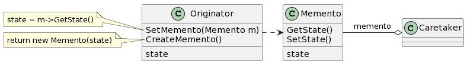
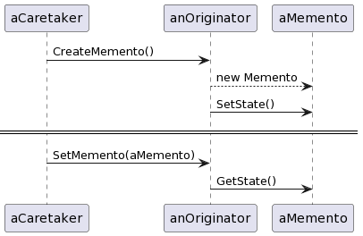

# Memento

## 意图

在不破坏封装性的前提下，捕获一个对象的内部状态，并在该对象之外保存这个状态。这样以后就可将该对象恢复到原先保存的状态。

## 动机

有时有必要记录一个对象的内部状态。为了允许用户取消不确定的操作或从错误中恢复过来，需要实现检查点和取消机制，而要实现这些机制，你必须事先将状态信息保存在某处，这样才能将对象恢复到它们先前的状态。但是对象通常封装了其部分或所有的状态信息，使得其状态不能被其他对象访问，也就不可能在该对象之外保存其状态。而暴露其内部状态又将违反封装的规则，可能有损应用的可靠性和可扩展性。

我们可用备忘录（Memento）模式解决这一问题。一个备忘录（memento）是一个对象，它存储另一个对象在某个瞬间的内部状态，而后者称为备忘录的原发器（originator）。当需要设置原发器的检查点时，取消操作机制会向原发器请求一个备忘录。原发器用描述当前状态的信息初始化该备忘录。只有原发器可以向备忘录中存取信息，备忘录对其他的对象“不可见”。

## 适用性

- 必须保存一个对象在某个时刻的（部分）状态，这样以后需要时它才能恢复到先前的状态。
- 如果一个接口让其他对象直接得到这些状态，将会暴露对象的实现细节并破坏对象的封装性。

## 结构

## 参与者

- Memento（备忘录，如SolverState）

—— 备忘录存储原发器对象的内部状态。原发器根据需要决定备忘录存储原发器的哪些内部状态。
—— 防止原发器以外的其他对象访问备忘录。备忘录实际上有两个接口，管理者（caretaker）只能看到备忘录的窄接口——它只能将备忘录传递给其他对象。相反，原发器能够看到一个宽接口，允许它访问返回到先前状态所需的所有数据。理想的情况是只允许生成本备忘录的那个原发器访问本备忘录的内部状态。

- Originator（原发器，如ConstraintSolver）

—— 原发器创建一个备忘录，用以记录当前时刻它的内部状态。
—— 使用备忘录恢复内部状态。

- Caretaker（管理者，如undo mechanism）

—— 负责保存好备忘录。
—— 不能对备忘录的内容进行操作或检查。

## 协作

- 管理者向原发器请求一个备忘录，保留一段时间后，将其送回给原发器，如下面的交互图所示。

有时管理者不会将备忘录返回给原发器，因为原发器可能根本不需要退到先前的状态。

- 备忘录是被动的。只有创建备忘录的原发器会对它的状态进行赋值和检索。

## 效果

1. 保持封装边界
2. 简化了原发器
3. 使用备忘录可能代价很高
4. 定义窄接口和宽接口
5. 维护备忘录的潜在代价

## 实现

1. 语言支持

> 可将Originator作为Memento的一个友元，并使Memento宽接口为私有的。只有窄接口应该被声明为公共的。

2. 存储增量式改变

> 如果备忘录的创建及其返回（给它们的原发器）的顺序是可预测的，备忘录可以仅存储原发器内部状态的增量改变。

## 相关模式

Command：命令可使用备忘录来为可撤销的操作维护状态。

Iterator：如前所述，备忘录可用于迭代。
