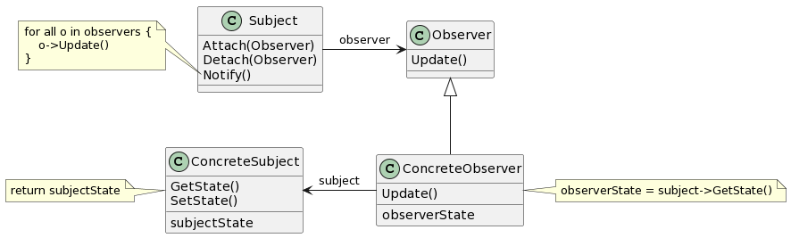
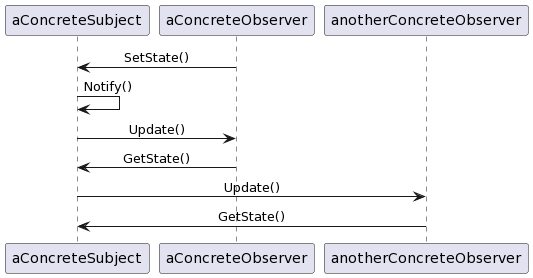

# Observer

## 意图

定义对象间的一种一对多的依赖关系，当一个对象的状态发生改变时，所有依赖于它的对象都得到通知并被自动更新。

## 动机

被一个系统分割成一系列相互协作的类有一个常见的副作用：需要维护相关对象间的一致性。我们不希望为了维持一致性而使各类紧密耦合，因为这样降低了其可复用性。

Observer模式描述了如何建立这种关系。这一模式中的关键对象是目标（subject）和观察者（observer）。一个目标可以有任意数目的依赖它的观察者。一旦目标的状态发生改变，所有的观察者都得到通知。作为对这个通知的响应，每个观察者都将查询目标以使其状态与目标的状态同步。

这种交互也称为发布 - 订阅（publish-subscribe）。目标是通知的发布者。它发出通知时并不需要知道谁是它的观察者，可以有任意数目的观察者订阅并接收通知。

## 适用性

- 一个抽象模型有两个方面，其中一个方面依赖于另一个方面。将这二者封装在独立的对象中，以使它们可以各自独立地改变和复用。
- 对一个对象的改变需要同时改变其他对象，而不知道具体有多少对象有待改变。
- 一个对象必须通知其他对象，而它又不能假定其他对象是谁。换言之，你不希望这些对象是紧密耦合的。

## 结构

## 参与者

- Subject（目标）

—— 目标知道它的观察者。可以有任意多个观察者观察同一个目标。
—— 提供注册和删除观察者对象的接口。

- Observer（观察者）

—— 为那些在目标发生改变时需要获得通知的对象定义一个更新接口。

- ConcreteSubject（具体目标）

—— 将有关状态存入各ConcreteObserver对象。
—— 当它的状态发生改变时，向其各个观察者发出通知。

- ConcreteObserver

—— 维护一个指向ConcreteSubject对象的引用。
—— 存储有关状态，这些状态应与目标的状态保持一致。
—— 实现Observer的更新接口，以使自身状态与目标的状态保持一致。

## 协作

- 当ConcreteSubject发生任何可能导致其观察者与其本身状态不一致的改变时，它将通知它的各个观察者。
- 在得到一个具体目标的改变通知后，ConcreteObserver对象可向目标对象查询信息。ConcreteObserver使用这些信息使它的状态与目标对象的状态一致。

下面的交互图说明了一个目标对象和两个观察者之间的协作：

注意发出改变请求的Observer对象并不立即更新，而是将其推迟到它从目标得到一个通知之后。Notify不总是由目标对象调用，它也可被一个观察者或其他对象调用。

## 效果

Observer模式允许你独立地改变目标和观察者。你可以单独复用目标对象而无须同时复用其观察者，反之亦然。它也使你可以在不改动目标和其他观察者的前提下增加观察者。

1. 目标和观察者之间的抽象耦合。
2. 支持广播通信。
3. 意外的更新。

## 实现

1. 创建目标到其观察者之间的映射
2. 观察多个目标
3. 谁触发更新

> - 由目标对象的状态设定操作在改变目标对象的状态后自动调用Notify。优点是客户不需要记住要在目标对象上调用Notify，缺点是多个连续的操作会产生多次连续的更新，可能效率较低。
> - 让客户负责在适当的时候调用Notify。优点是客户可以在一系列的状态改变完成后一次性地触发更新，避免了不必要的中间更新。缺点是给客户增加了触发更新的责任。由于客户可能会忘记调用Notify，这种方式较易出错。

4. 对已删除目标的悬挂引用
5. 在发出通知前确保目标的状态自身是一致的
6. 避免特定于观察者的更新协议——推/拉模型

>推模型（push model）：目标向观察者发送关于改变的详细信息，而不管它们需要与否。
>拉模型（pull model）：目标除最小通知外什么也不送出，而在此之后由观察者显式地向目标询问细节。
>拉模型强调的是目标不知道它的观察者，而推模型假定目标知道一些观察者需要的信息。推模型可能使得观察者相对难以复用，因为目标对观察者的假定可能并不总是正确的。另一方面，拉模型可能效率较差，因为观察者对象需要在没有目标对象帮助的情况下确定什么改变了。

7. 显式地指定感兴趣的改变
8. 封装复杂的更新语义

>当目标和观察者间的依赖关系特别复杂时，可能需要一个维护这些关系的对象。我们称这样的对象为更改管理器（ChangeManager）。它的目的是尽量减少观察者反映其目标的状态变化所需的工作量。
ChangeManager有三个责任：

>- 它将一个目标映射到它的观察者并提供一个接口来维护一个映射。这就不需要由目标来维护对其观察者的引用，反之亦然。
>- 它定义一个特定的更新策略。
>- 根据一个目标的请求，它更新所有依赖于这个目标的观察者。

9. 结合目标类和观察者类

## 相关模式

Mediator：通过封装复杂的更新语义，ChangeManager充当目标和观察者之间的中介者。
Singleton：ChangeManager可使用Singleton模式来保证它是唯一的并且是可全局访问的。
