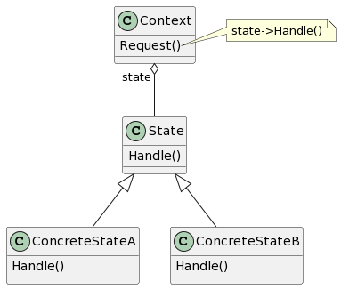

# State

## 意图

允许一个对象在其内部状态改变时改变它的行为。对象看起来似乎修改了它的类。

## 动机

State模式描述了对象如何在每一种状态下表现出不同的行为。

## 适用性

- 一个对象的行为取决于它的状态，并且它必须在运行时根据状态改变它的行为。
- 一个操作中含有庞大的多分支的条件语句，且这些分支依赖于该对象的状态。这个状态通常用一个或多个枚举常量表示。通常，有多个操作包含这一相同的条件结构。State模式将每一个条件分支放入一个独立的类中。这使得你可以根据对象自身的情况将对象的状态作为一个对象，这一对象可以不依赖于其他对象而独立变化。

## 结构

## 参与者

- Context（环境）

—— 定义客户感兴趣的接口。
—— 维护一个ConcreteState子类的实例，这个实例定义当前状态。

- State

—— 定义一个接口以封装与Context的一个特定状态相关的行为。

- ConcreteState subclasses（具体状态子类）

—— 每一子类实现一个与Context的一个状态相关的行为。

## 协作

- Context将与状态相关的请求委托给当前的ConcreteState对象处理。
- Context可将自身作为一个参数传递给处理该请求的状态对象。这使得状态对象在必要时可访问Context。
- Context是客户使用的主要接口。客户可用状态对象来配置一个Context，一旦一个Context配置完毕，它的客户不再需要直接与状态对象打交道。
- Context或ConcreteState子类都可决定哪个状态是另外一个的后继者，以及是在何种条件下进行状态转换。

## 效果

1. 将与特定状态相关的行为局部化，并且将不同状态的行为分割开来。
2. 使得状态转换显示化。
3. State对象可被共享。
