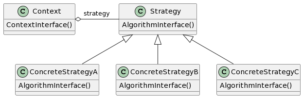

# Strategy

## 意图

定义一系列的算法，把它们一个个封装起来，并且使它们可相互转换。本模式使得算法可独立于使用它的客户而变化。

## 动机

定义一些类来封装不同的算法。一个以这种方法封装的算法称为策略（strategy）。

## 适用性

- 许多相关的类仅仅是行为有异。“策略”提供了一种用多个行为中的一个行为来配置一个类的方法。
- 需要使用一个算法的不同变体。
- 算法使用客户不应该知道的数据。可使用策略模式以避免暴露复杂的、与算法相关的数据结构。
- 一个类定义了多种行为，并且这些行为在这个类的操作中以多个条件语句的形式出现。将相关的条件分支移入它们各自的Strategy类中以代替这些条件语句。

## 结构

## 参与者

- Strategy（策略，如Compositor）

—— 定义所有支持的算法的公共接口。Context是用这个接口来调用某ConcreteStrategy定义的算法。

- ConcreteStrategy（具体策略，如SimpleCompositor、TeXCompositor、ArrayCompositor）

—— 以Strategy接口实现某具体算法。

- Context（上下文，如Composition）

—— 用一个ConcreteStrategy对象来配置。
—— 维护一个对Strategy对象的引用。
—— 可定义一个接口来让Strategy访问它的数据。

## 协作

- Strategy和Context相互作用以实现选定的算法。当算法被调用时，Context可以将该算法所需要的所有数据都传递给该Strategy。或者，Context可以将自身作为一个参数传递给Strategy操作。这就让Strategy在需要时可以回调Context。
- Context将客户的请求转发给它的Strategy。客户通常创建并传递一个ConcreteStrategy对象给该Context，这样，客户仅与Context交互。通常有一系列的ConcreteStrategy类可供客户从中选择。

## 效果

1. 相关算法系列
2. 一个替代继承的方法
3. 消除了一些条件语句
4. 实现的选择
5. 客户必须了解不同的Strategy
6. Strategy和Context之间的通信开销
7. 增加了对象的数目

## 实现

1. 定义Strategy和Context接口

> Strategy和Context接口必须使得ConcreteStrategy能够有效地访问它所需要的Context中的任何数据，反之亦然。一种办法是让Context将数据放在参数中传递给Strategy操作——将数据发送给Strategy。这使得Strategy和Context解耦。但另一方面，Context可能发送一些Strategy不需要的数据。
> 另一种办法是让Context将自身作为一个参数传递给Strategy，该Strategy再显式地向该Context请求数据。或者，Strategy可以存储对它的Context的一个引用，这样根本不再需要传递任何东西。这两种情况下，Strategy都可以请求到它所需要的数据。但现在Context必须对它的数据定义一个更为精细的接口，这将Strategy和Context更紧密地耦合在一起。

2. 将Strategy作为模板参数
3. 使Strategy对象成为可选的

## 相关模式

Flyweight：Strategy对象经常是很好的轻量级对象。
