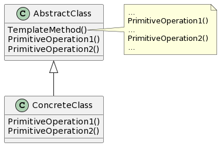

# Template Method

## 意图

定义一个操作中的算法的骨架，而将一些步骤延迟到子类中。TemplateMethod使得子类可以不改变一个算法的结构即可重定义该算法的某些特定步骤。

## 动机

一个模板方法用一些抽象的操作定义一个算法，而子类将重定义这些操作以提供具体的行为。

通过使用抽象操作定义一个算法中的一些步骤，模板方法确定了它们的先后顺序，但它允许子类改变这些具体步骤以满足各自的需求。

## 适用性

- 一次性实现一个算法的不变部分，并将可变的行为留给子类来实现。
- 各子类中公共的行为应被提取出来并集中到一个公共父类中以避免代码重复。首先识别现有代码中的不同之处，并且将不同之处分离为新的操作。最后，用一个调用新的操作的模板方法来替换不同的代码。
- 控制子类扩展。模板方法只在特定点调用钩子操作，这样就只允许在这些点进行扩展。

## 结构

## 参与者

- AbstractClass（抽象类，如Application）

—— 定义抽象的原语操作（primitive operation），具体的子类将重定义它们以实现一个算法的各步骤。
—— 实现一个模板方法，定义一个算法的骨架。该模板方法不仅调用原语操作，也调用定义在AbstractClass或其他对象中的操作。

- ConcreteClass（具体类，如MyApplication）

—— 实现原语操作以完成算法中与特定子类相关的步骤。

## 协作

- ConcreteClass靠AbstractClass来实现算法中不变的步骤。

## 效果

模板方法是一种代码复用的基本技术。它们在类库中尤为重要，提取了类库中的公共行为。

模板方法导致一种反向的控制结构。这指的是一个父类调用一个子类的操作，而不是相反。

模板方法调用下列类型的操作：

- 具体的操作（ConcreteClass或对客户类的操作）。
- 具体的AbstractClass的操作（即通常对子类有用的操作）。
- 原语操作（即抽象操作）。
- Factory Method
- 钩子操作（hook operation），它提供了缺省的行为，子类可以在必要时进行扩展。钩子操作在缺省情况下通常是空操作。

很重要的一点是模板方法应该指明哪些操作是钩子操作（可以被重定义）以及哪些是抽象操作（必须被重定义）。要有效地复用一个抽象类，子类编写者必须明确了解哪些操作是设计为有待重定义的。

## 实现

1. 使用C++访问控制
2. 尽量减少原语操作
3. 命名约定

## 相关模式

Factory Method常被模板方法调用。

Strategy：模板方法使用继承来改变算法的一部分，Strategy使用委托来改变整个算法。
