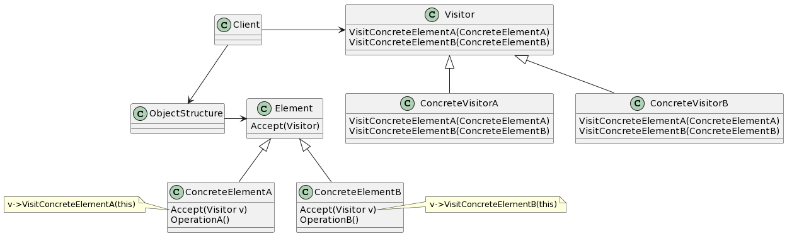
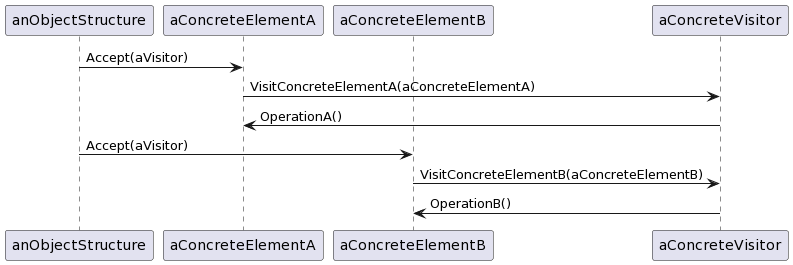

# Visitor

## 意图

表示一个作用于某对象结构中的各元素的操作。它使你可以在不改变各元素的类的前提下定义作用于这些元素的新操作。

## 动机

将一个类中相关的操作包装在一个独立的对象（称为一个Visitor）中，并在遍历抽象语法树时将此对象传递给当前访问的元素。当一个元素“接受”该访问者时，该元素向访问者发送一个包含自身类信息的请求。该请求同时也将该元素本身作为一个参数。然后访问者将为该元素执行该操作——这一操作以前是在该元素的类中的。

## 适用性

- 一个对象结构包括很多类对象，它们有不同的接口，而你想对这些对象实施一些依赖于其具体类的操作。
- 需要对一个对象结构中的对象进行很多不同并且不相关的操作，而你想避免让这些操作“污染”这些对象的类。Visitor使得你可以将相关的操作集中起来定义在一个类中。当该对象结构被很多应用共享时，用Visitor模式让每个应用仅包含需要用到的操作。
- 定义对象结构的类很少改变，但经常需要在此结构上定义新的操作。改变对象结构类需要重定义对所有访问者的接口，这可能需要很大的代价。如果对象结构类经常改变，那么可能还是在这些类中定义这些操作比较好。

## 结构

## 参与者

- Visitor（访问者，如NodeVisitor）

—— 为该对象结构中ConcreteElement的每一个类声明一个Visit操作。该操作的名字和特征标识了发送Visit请求给该访问者的类。这使得访问者可以确定正被访问元素的具体的类。这样访问者就可以通过该元素的特定接口直接访问它。

- ConcreteVisitor（具体访问者，如TypeCheckingVisitor）

—— 实现每个由Visitor声明的操作。每个操作实现本算法的一部分，而该算法片段是对应于结构中对象的类。ConcreteVisitor为该算法提供了上下文并存储它的局部状态。这一状态常常在遍历该结构的过程中累计结果。

- Element（元素，如Node）

—— 定义一个Accept操作，它以一个访问者为参数。

- ConcreteElement（具体元素，如AssignmentNode、VariableRefNode）

—— 实现Accept操作，该操作以一个访问者为参数。

- ObjectStructure

—— 能枚举它的元素。
—— 可以提供一个高层的接口以允许该访问者访问它的元素。
—— 可以是一个组合（参加Composite）或是一个集合，如一个列表或一个无序集合。

## 协作

- 一个使用Visitor模式的客户必须创建一个ConcreteVisitor对象，然后遍历该对象结构，并用该访问者访问每一个元素。
- 当一个元素被访问时，它调用对应于它的类的Visitor操作。如果必要，该元素将自身作为这个操作的一个参数，以便该访问者访问它的状态。

下面的交互框图说明了一个对象结构、一个访问者和两个元素之间的协作。

## 效果

1. 访问者模式使得易于增加新的操作
2. 访问者集中相关的操作而分离无关的操作
3. 增加新的ConcreteElement类很困难
4. 通过类层次进行访问
5. 累积状态
6. 破坏封装

## 实现

1. 谁负责遍历对象结构

## 相关模式

Composite：访问者可以用于对一个由Composite模式定义的对象结构进行操作。

Interpreter：访问者可以用于解释。
