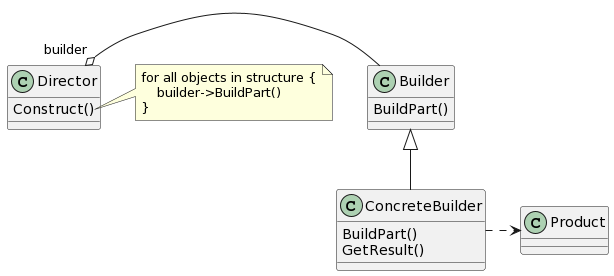

# Builder

## 意图

将一个复杂对象的构建与它的表示分离，使得同样的构建过程可以创建不同的表示。

## 动机

## 适用性

- 当创建复杂对象的算法应该独立于该对象的组成部分以及它们的装配方式时。
- 当构造过程必须允许被构造的对象有不同的表示时。

## 结构

## 参与者

- Builder（TextConverter）

—— 为创建一个Product对象的各个部件指定抽象接口。

- ConcreteBuilder（ASCIIConverter、TeXConverter、TextWidgetConverter）

—— 实现Builder的接口以构造和装配该产品的各个部件。
—— 定义并跟踪它所创建的表示。
—— 提供一个检索产品的接口（例如，GetASCIIText和GetTextWidget）。

- Director（RTFReader）

—— 构造一个使用Builder接口的对象。

- Product（ASCIIText、TeXText、TextWidget）

—— 表示被构造的复杂对象。ConcreteBuilder创建该产品的内部表示并定义它的装配过程。
—— 包含定义组成部件的类，包括将这些部件装配成最终产品的接口。

## 协作

- 客户创建Director对象，并用它所想要的Builder对象进行配置。
- 一旦生成了产品部件，导向器就会通知生成器。
- 生成器处理导向器的请求，并将部件添加到该产品中。
- 客户从生成器中检索产品。

## 效果

1. 它使你可以改变一个产品的内部表示。
2. 它将构造代码和表示代码分开。
3. 它使你可对构造过程进行更精细的控制。

## 实现

1. 装配和构造接口。
2. 为什么产品没有抽象类。
3. 在Builder中缺省的方法为空。

## 相关模式

Abstract Factory与Builder相似，因为它也可以创建复杂对象。主要的区别是Builder模式着重于一步步构造一个复杂对象。而Abstract Factory着重于多个系列的产品对象（简单的或是复杂的）。Builder在最后一步返回产品，而对于Abstract Factory来说，产品是立即返回的。
Composite通常是用Builder生成的。
