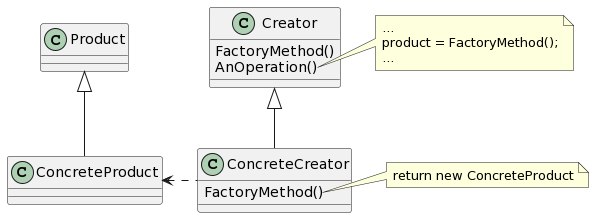

# Factory Method

## 意图

定义一个用于创建对象的接口，让子类决定实例化哪一个类。Factory Method使一个类的实例化延迟到其子类。

## 动机

。

## 适用性

- 当一个类不知道它所必须创建的对象的类的时候。
- 当一个类希望由它的子类来指定它所创建的对象的时候。
- 当类将创建对象的职责委托给多个帮助子类中的某一个，并且你希望将哪一个帮助子类是代理者这一信息局部化的时候。

## 结构

## 参与者

- Product（Document）

—— 定义工厂方法所创建的对象的接口。

- ConcreteProduct（MyDocument）

—— 实现Product接口。

- Creator（Application）

—— 声明工厂方法，该方法返回一个Product类型的对象。Creator也可以定义一个工厂方法的缺省实现，它返回一个缺省的ConcreteProduct对象。
—— 可以调用工厂方法以创建一个Product对象。

- ConcreteCreator（MyApplication）

—— 重定义工厂方法以返回一个ConcreteProduct实例。

## 协作

- Creator依赖于它的子类来定义工厂方法，所以它返回一个适当的ConcreteProduct实例。

## 效果

1. 为子类提供钩子（hook）。
2. 连接平行的类层次。

## 实现

1. 主要有两种不同的情况。
2. 参数化工厂方法。
3. 特定语言的变化和问题。
4. 使用模板以避免创建子类。
5. 命名约定。
