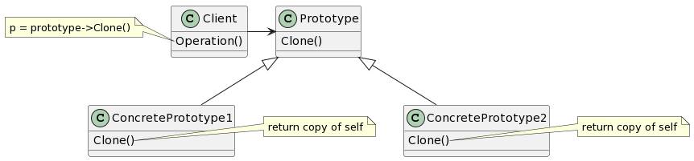

# Prototype

## 意图

用原型实例指定创建对象的种类，并且通过拷贝这些原型创建新的对象。

## 动机

## 适用性

- 当一个系统应该独立于它的产品创建、构成和表示时。
- 当要实例化的类是在运行时指定时，例如，通过动态重载。
- 为了避免创建一个与产品类层次平行的工厂类层次时。
- 当一个类的实例只能有几个不同状态组合中的一种时。建立相应数目的原型并克隆它们可能比每次用合适的状态手工实例化该类更方便一些。

## 结构

## 参与者

- Prototype（Graphic）

—— 声明一个克隆自身的接口。

- ConcretePrototype（Staff、WholeNote、HalfNote）

—— 实现一个克隆自身的操作。

- Client（GraphicTool）

—— 让一个原型克隆自身从而创建一个新的对象。

## 协作

- 客户请求一个原型克隆自身。

## 效果

1. 运行时增加和删除产品。
2. 改变值以指定新对象。
3. 改变结构以指定新对象。
4. 减少子类的构造。
5. 用类动态配置应用。

## 实现

1. 使用一个原型管理器。
2. 实现克隆操作。
3. 初始化克隆对象。

## 相关模式

Prototype和Abstract Factory模式在某些方面是相互竞争的。但是它们也可以一起使用。Abstract Factory可以存储一个被克隆的原型的集合，并且返回产品对象。
大量使用Composite和Decorator模式的设计通常也可从Prototype模式获益。
