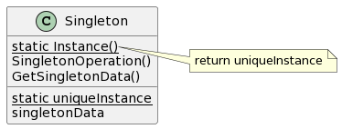

# Singleton

## 意图

保证一个类仅有一个实例，并提供一个访问它的全局访问点。

## 动机

保证一个类只有一个实例并且这个实例易于被访问。

## 适用性

- 当类只能有一个实例而且客户可以从一个众所周知的访问点访问它时。
- 当这个唯一实例应该是通过子类化可扩展的，并且客户应该无须更改代码就能使用一个扩展的实例时。

## 结构

## 参与者

- Singleton

—— 定义一个Instance操作，允许客户访问它的唯一实例。Instance是一个静态成员函数。
—— 可能负责创建它自己的唯一实例。

## 协作

- 客户只能通过Singleton的Instance操作访问一个Singleton的实例。

## 效果

1. 对唯一实例的受控访问。
2. 缩小名字空间。
3. 允许对操作和表示的精化。
4. 允许可变数目的实例。
5. 比类操作更灵活。
