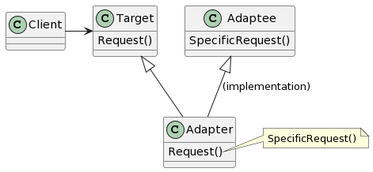
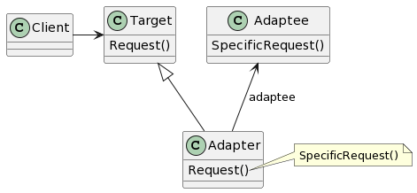

# Adapter

## 意图

将一个类的接口转换成客户希望的另外一个接口，Adapter模式使得原本由于接口不兼容而不能一起工作的那些类可以一起工作。

## 动机

## 适用性

- 你想使用一个已经存在的类，而它的接口不符合你的需求。
- 你想创建一个可以复用的类，该类可以与其他不相关的类或不可预见的类（即那些接口可能不一定兼容的类）协同工作。
- （仅适用于对象Adapter）你想使用一些已经存在的子类，但是不可能对每一个都进行子类化以匹配它们的接口。对象适配器可以适配它的父类接口。

## 结构

类模式：

对象模式：

## 参与者

- Target（Shape）

—— 定义Client使用的与特定领域相关的接口。

- Client（DrawingEditor）

—— 与符合Target接口的对象协同。

- Adaptee（TextView）

—— 定义一个已经存在的接口，这个接口需要适配。

- Adapter（TextShape）

—— 对Adaptee的接口与Target接口进行适配。

## 协作

- Client在Adapter实例上调用一些操作。接着适配器调用Adaptee的操作实现这个请求。

## 效果

类适配器和对象适配器有不同的权衡。类适配器的权衡为：

- 用一个具体的Adapter类对Adaptee和Target进行匹配。结果是当我们想要匹配一个类以及所有它的子类时，类Adapter将不能胜任工作。
- 使得Adapter可以重定义Adaptee的部分行为，因为Adapter是Adaptee的一个子类。
- 仅仅引入了一个对象，并不需要额外的指针以间接得到Adaptee。

对象适配器的权衡为：

- 允许一个Adapter与多个Adaptee——Adaptee本身以及它的所有子类（如果有子类的话）——同时工作。Adapter也可以一次给所有的Adapter添加功能。
- 使得重定义Adaptee的行为比较困难。这就需要生成Adaptee的子类并且使得Adapter引用这个子类而不是引用Adaptee本身。

1. Adapter的匹配程度。
2. 可插入的Adapter。
3. 使用双向适配器提供透明操作。

## 实现

1. 使用C++实现适配器类时，Adapter类应该采用公共方式继承Target类，并且用私有方式继承Adaptee类。因此，Adapter类应该是Target类的子类型，但不是Adaptee的子类型。
2. 可插入的适配器。为Adaptee找到一个“窄”接口，即可用于适配的最小操作集。三个实现途径：

- 使用抽象操作
- 使用代理对象
- 参数化的适配器

## 相关模式

模式Bridge的结构与对象适配器类似，但是Bridge模式的出发点不同：Bridge的目的是将接口部分和实现部分分离，从而可以对它们较为容易也相对独立地加以改变。而Adapter则意味着改变一个已有对象的接口。

Decorator模式增强了其他对象的功能而同时又不改变它的接口，因此Decorator对应用程序的透明性比适配器要好。结果是Decorator支持递归组合，而纯粹使用适配器是不可能实现这一点的。

模式Proxy在不改变它的接口的条件下，为另一个对象定义了一个代理。
