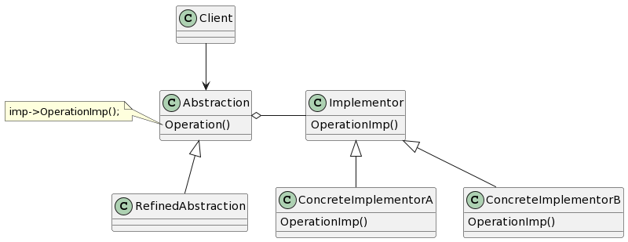

# Bridge

## 意图

将抽象部分与它的实现部分分离，使它们可以独立地变化。

## 动机

## 适用性

- 你不希望在抽象和它的实现部分之间有一个固定的绑定关系。例如，这种情况可能是因为，在程序运行时实现部分应可以被选择或者替换。
- 类的抽象和它的实现都应该可以通过生成子类的方法加以扩充。这时Bridge模式使你可以对不同的抽象接口和实现部分进行组合，并分别对它们进行扩充。
- 对一个抽象的实现部分的修改应对客户不产生影响，即客户的代码不必重新编译。
- （C++）你想对客户完全隐藏抽象的实现部分。在C++中，类的表示在类接口中是可见的。
- 有许多类要生成。这样一种类层次结构说明你必须将一个对象分解成两个部分。
- 你想在多个对象间共享实现（可能使用引用计数），但同时要求客户并不知道这一点。

## 结构

## 参与者

- Abstraction（Window）

—— 定义抽象类的接口。
—— 维护一个指向Implementor类型对象的指针。

- RefinedAbstraction（IconWindow）

—— 扩充由Abstraction定义的接口。

- Implementor（WindowImp）

—— 定义实现类的接口，该接口不一定要与Abstraction的接口完全一致，事实上这两个接口可以完全不同。一般来讲，Implementor接口仅提供基本操作，而Abstraction则定义了基于这些基本操作的较高层次的操作。

- ConcreteImplementor（XWindowImp、PMWindowImp）

—— 实现Implementor接口并定义它的具体实现。

## 协作

- Abstraction将client的请求转发给它的Implementor对象。

## 效果

1. 分离接口及其实现部分。
2. 提高可扩充性。
3. 实现细节对客户透明。

## 实现

1. 仅有一个Implementor。在仅有一个实现的时候，没有必要创建一个抽象的Implementor类。
2. 创建正确的Implementor对象。
3. 共享Implementor对象。
4. 采用多重继承机制。

## 相关模式

Abstract Factory模式可以用来创建和配置一个特定的Bridge模式。

Adapter模式用来帮助无关的类协同工作，它通常在系统设计完成后才会被使用。然而，Bridge模式则是在系统开始时就被使用，它使得抽象接口和实现部分可以独立进行改变。
