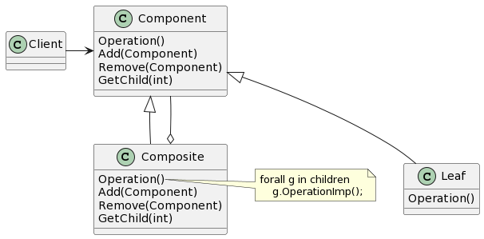

# Composite

## 意图

将对象组合成树形结构以表示“部分 - 整体”的层次结构。Composite使得用户对单个对象和组合对象的使用具有一致性。

## 动机

## 适用性

- 你想表示对象的部分 - 整体层次结构。
- 你希望用户忽略组合对象与单个对象的不同，用户将统一地使用组合结构中的所有对象。

## 结构

## 参与者

- Component（Graphic）

—— 为组合中的对象声明接口。
—— 在适当的情况下，实现所有类共有接口的缺省行为。
—— 声明一个接口用于访问和管理Component的子组件。
—— （可选）在递归结构中定义一个接口，用于访问一个父部件，并在合适的情况下实现它。

- Leaf（Rectangle、Line、Text等）

—— 在组合中表示叶节点对象，叶节点没有子节点。
—— 在组合中定义图元对象的行为。

- Composite（Picture）

—— 定义有子部件的那些部件的行为。
—— 存储子部件。
—— 在Component接口中实现与子部件有关的操作。

- Client

—— 通过Component接口操纵组合部件的对象。

## 协作

- 用户使用Component类接口与组合结构中的对象进行交互。如果接收者是一个叶节点，则直接处理请求。如果接收者是Composite，它通常将请求发送给它的子部件，在转发请求之前和/或之后可能执行一些辅助操作。

## 效果

1. 定义了包含基本对象和组合对象的类层次结构。
2. 简化客户代码。
3. 使得更容易增加新类型的组件。
4. 使你的设计变得更加一般化。

## 实现

1. 显式的父部件引用。
2. 共享组件。
3. 最大化Component接口。
4. 声明管理子部件的操作。
5. Component是否应该实现一个Component列表。
6. 子部件排序。
7. 使用高速缓冲存储改善性能。
8. 应该由谁删除Component。
9. 存储组件最好用哪种数据结构。

## 相关模式

通常，部件 - 父部件连接用于Responsibility of Chain模式。

Decorator模式经常与Composite模式一起使用。当装饰和组合一起使用时，它们通常有一个公共的父类。因此装饰必须支持具有Add、Remove和GetChild操作的Component接口。

Flyweight让你共享组件，但不再能引用其父部件。

Iterator可用来遍历Composite。

Visitor将本来应该分布在Composite和Leaf类中的操作和行为局部化。
