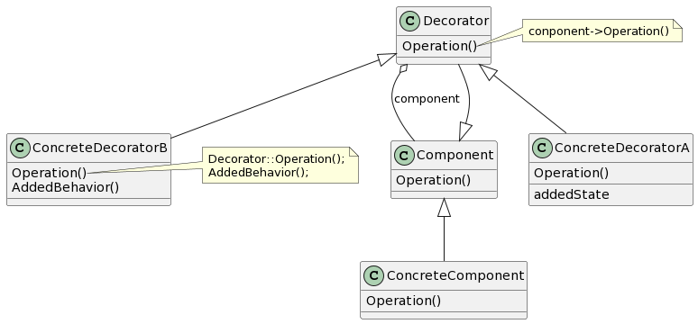

# Decorator

## 意图

动态地给一个对象添加一些额外的职责。就增加功能来说，Decorator模式相比生成子类更为灵活。

## 动机

有时我们希望给某个对象而不是整个类添加一些功能。一种较为灵活的方式是将组件嵌入另一个对象中，由这个对象添加边框。我们称这个嵌入的对象为装饰。

## 适用性

- 在不影响其他对象的情况下，以动态、透明的方式给单个对象添加职责。
- 处理那些可以撤销的职责。
- 当不能采用生成子类的方法进行扩充时。一种情况是，可能有大量独立的扩展，为支持每一种组合将产生大量的子类，使得子类数目呈爆炸性增长。另一种情况可能是，类定义被隐藏，或类定义不能用于生成子类。

## 结构

## 参与者

- Component（VisualComponent）

—— 定义一个对象接口，可以给这些对象动态地添加职责。

- ConcreteComponent（TextView）

—— 定义一个对象，可以给这个对象添加一些职责。

- Decorator

—— 维持一个指向Component对象的指针，并定义一个与Component接口一致的接口。

- ConcreteDecorator（BorderDecorator、ScrollDecorator）

—— 向组件添加职责。

## 协作

- Decorator将请求转发给它的Component对象，并有可能在转发请求前后执行一些附加的动作。

## 效果

1. 比静态继承更灵活。
2. 避免在层次结构高层的类有太多的特征。
3. Decorator与它的Component不一样。
4. 有许多小对象。

## 实现

1. 接口的一致性。
2. 省略抽象的Decorator类。
3. 保持Component类的简单性。
4. 改变对象外壳与改变对象内核。

## 相关模式

Adapter：Decorator模式不同于Adapter模式，因为装饰仅改变对象的职责而不改变它的接口；而适配器将给对象一个全新的接口。

Composite：可以将装饰视为一个退化的、仅有一个组件的组合。然而，装饰仅给对象添加一些额外的职责——它的目的不在于对象聚集。

Strategy：用一个装饰可以改变对象的外表；而Strategy模式使得你可以改变对象的内核。这是改变对象的两种途径。
