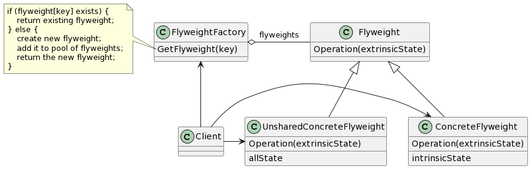

# Flyweight

## 意图

运用共享技术有效地支持大量细粒度的对象。

## 动机

flyweight是一个共享对象，它可以在多个场景中使用，并且在每个场景中flyweight都可以作为一个独立的对象——这一点与非共享对象的实例没有区别。flyweight不能对它所运行的场景做出任何假设，这里的关键概念是内部状态和外部状态之间的区别。内部状态存储于flyweight中，它包含了独立于flyweight场景的信息，这些信息使得flyweight可以被共享。而外部状态取决于flyweight场景，并根据场景而变化，因此不可共享。用户对象负责在必要的时候将外部状态传递给flyweight。

Flyweight模式对那些通常由于数量太大而难以用对象来表示的概念或实体进行建模。

## 适用性

- 一个应用程序使用了大量的对象。
- 完全由于使用大量的对象造成很大的存储开销。
- 对象的大多数状态都可变为外部状态。
- 如果删除对象的外部状态，那么可以用相对较少的共享对象取代很多组对象。
- 应用程序不依赖于对象标识。由于Flyweight对象可以被共享，因此对于概念上明显有别的对象，标识测试将返回真值。

## 结构

## 参与者

- Flyweight（Glyph）

—— 描述一个接口，通过这个接口flyweight可以接受并作用于外部状态。

- ConcreteFlyweight（Character）

—— 实现Flyweight接口，并为内部状态（如果有的话）增加存储空间。ConcreteFlyweight对象必须是可共享的。它所存储的状态必须是内部的，即它必须独立于ConcreteFlyweight对象的场景。

- UnsharedConcreteFlyweight（Row、Column）

—— 并非所有的Flyweight子类都需要被共享。Flyweight接口使共享成为可能，但它并不强制共享。在flyweight对象结构的某些层次，UnsharedConcreteFlyweight对象通常将ConcreteFlyweight对象作为子结点（Row和Column就是这样）。

- FlyweightFactory

—— 创建并管理flyweight对象。
—— 确保合理地共享flyweight。当用户请求一个flyweight时，FlyweightFactory对象提供一个已创建的实例或者创建一个（如果不存在的话）。

- Client

—— 维持一个对flyweight的引用。
—— 计算或存储一个（多个）flyweight的外部状态。

## 协作

- flyweight执行时所需的状态必定是内部的或外部的。内部状态存储于ConcreteFlyweight对象之中，而外部状态则由Client对象存储或计算。当用户调用flyweight对象的操作时，将该状态传递给它。
- 用户不应直接对ConcreteFlyweight类进行实例化，而只能从FlyweightFactory对象得到ConcreteFlyweight对象，这可以保证对它们适当地进行共享。

## 效果

使用Flyweight模式时，传输、查找和/或计算外部状态都会产生运行时开销，尤其当flyweight原先被存储为内部状态时。然而，空间上的节省抵消了这些开销。共享的flyweight越多，空间节省也就越大。

## 实现

1. 删除外部状态。
2. 管理共享对象。

## 相关模式

Flyweight模式通常和Composite模式结合起来，用共享叶结点的有向无环图实现一个逻辑上的层次结构。

通常，最好用flyweight实现State和Strategy对象。
