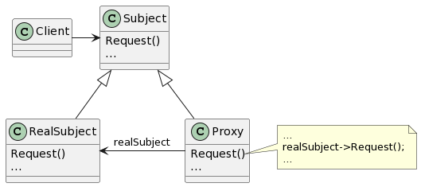

# Proxy

## 意图

为其他对象提供一种代理以控制对这个对象的访问。

## 动机

对一个对象进行访问控制的一个原因是只有在我们确实需要这个对象时才对它进行创建和初始化。对于每一个开销很大的对象，应该根据需要进行创建。

问题的解决方案是使用另一个对象（即Proxy）替代那个真正的对象。Proxy可以代替一个对象，并且在需要时负责实例化这个对象。

## 适用性

1. 远程代理（Remote Proxy）为一个对象在不同的地址空间提供局部代表。
2. 虚代理（Virtual Proxy）根据需要创建开销很大的对象
3. 保护代理（Protection Proxy）控制对原始对象的访问。保护代理用于对象应该有不同的访问权限的时候。
4. 智能指引（Smart Reference）取代了简单的指针，它在访问对象时执行一些附加操作。

智能指引的典型用途包括：

- 对指向实际对象的引用计数，这样当该对象没有引用时，可以自动释放它。
- 当第一次引用一个持久对象时，将它装入内存。
- 在访问一个实际对象前，检查是否已经锁定了它，以确保其他对象不能改变它。

## 结构

## 参与者

- Proxy（ImageProxy）

—— 保存一个引用使得代理可以访问实体。若RealSubject和Subject的接口相同，Proxy会引用Subject。
—— 提供一个与Subject的接口相同的接口，这样代理就可以用来替代实体。
—— 控制对实体的存取，并可能负责创建和删除它。

其他功能依赖于代理的类型：

> - Remote Proxy负责对请求及其参数进行编码，并向不同地址空间中的实体发送已编码的请求。
> - Virtual Proxy可以缓存实体的附加信息，以便延迟对它的访问。
> - Protection Proxy检查调用者是否具有实现一个请求所必需的访问权限。

- Subject（Graphic）

—— 定义RealSubject和Proxy的共用接口，这样就在任何使用RealSubject的地方都可以使用Proxy。

- RealSubject（Image）

—— 定义Proxy所代表的实体。

## 协作

- 代理根据其种类，在适当的时候向RealSubject转发请求。

## 效果

1. Remote Proxy可以隐藏一个对象存在于不同地址空间的事实。
2. Virtual Proxy可以进行最优化，例如根据要求创建对象。
3. Protection Proxies和Smart Reference都允许在访问一个对象时有一些附加的内务处理（housekeeping task）。

copy-on-write可以大幅度地降低拷贝庞大实体时的开销。

## 实现

1. 重载C++中的存取运算符。
2. Proxy并不总是需要知道实体的类型。

## 相关模式

Adapter：适配器为它所适配的对象提供了一个不同的接口。相反，代理提供了与它的实体相同的接口。然而，用于访问保护的代理可能会拒绝执行实体会执行的操作，因此它的接口实际上可能只是实体接口的一个子集。

Decorator：尽管装饰的实现部分与代理相似，但装饰的目的不一样。装饰为对象添加一个或多个功能，而代理则控制对对象的访问。

代理的实现和装饰的实现类似，但是在相似的程度上有所差别。Protection Proxy的实现可能与装饰的实现差不多。另外，Remote Proxy不包含对实体的直接引用，而只是一个间接引用，如“主机ID，主机上的局部地址”。Virtual Proxy开始的时候使用一个间接引用，例如一个文件名，但最终将获取并使用一个直接引用。
